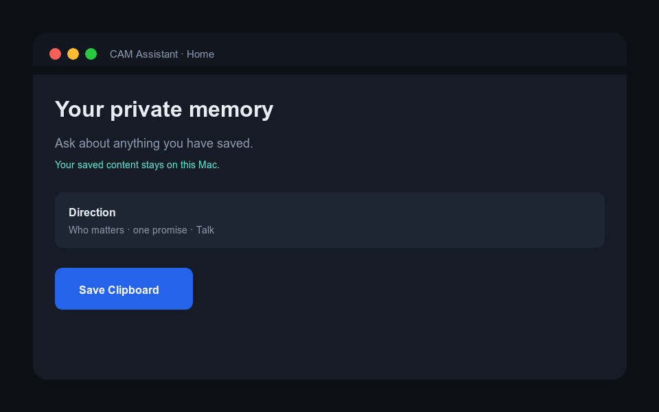
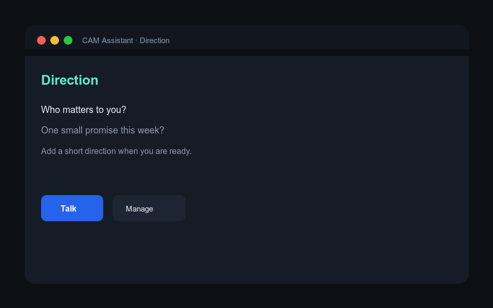
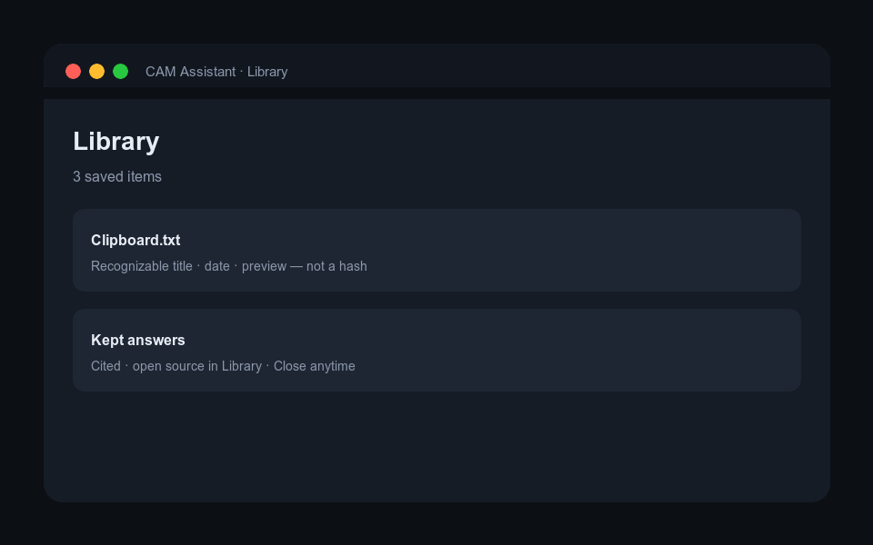
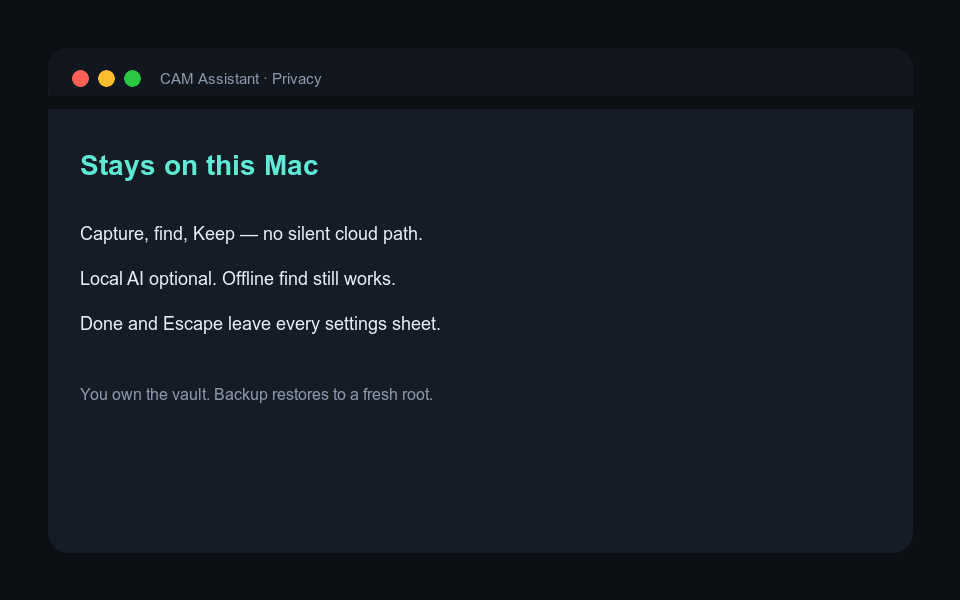

# CAM Assistant

**Private memory that stays yours** — with a thin **Direction** strip for people and promises.

Local-first macOS app for people who **capture everything and then can’t find it**, and who still need **continuity with real humans and open promises** — without pasting sensitive life into a cloud chat.

| | |
|--|--|
| **Platform** | macOS 15+, Apple Silicon recommended |
| **Stack** | Swift 6.0+ tools · SwiftPM · standalone repo |
| **Data** | On this Mac (`~/Library/Application Support/CAMAssistant/`) |
| **Models** | Optional local server (LM Studio / Ollama). **Find works offline.** |
| **License** | MIT |

**Landing page:** open [`docs/landing/index.html`](docs/landing/index.html) locally, or the GitHub Pages site once Actions deploys (`Settings → Pages` uses the workflow in `.github/workflows/pages.yml`).

---

## What it does

```text
Save once  →  Find with sources  →  Keep only what matters
                 ↑
         Direction on Home
     (people · promises · Talk)
```

### Three ordinary places

| Place | Job |
|-------|-----|
| **Home** | Direction strip · Save Clipboard · Find / Ask · Keep / Discard |
| **Library** | Browse, search, hide/restore, open citations, kept answers |
| **Settings** | Watched folders · Local AI · Backup & Restore · Advanced (endpoints / hotkeys) |

Sheets always have **Done** and **Escape**. Library detail has **Close**.

### Product walkthrough (GIFs)

Illustrated product loops (same language as the live app; open the app for the real UI):

| Flow | Preview |
|------|---------|
| **Save → Find → Keep** |  |
| **Direction** |  |
| **Library** |  |
| **Private by default** |  |

Full narrative + comparison table: **[docs/landing/index.html](docs/landing/index.html)**

---

## Why you would want it

| If you feel… | CAM Assistant gives you… |
|--------------|---------------------------|
| “I capture everything and lose it” | Save once → Library → Ask without inventing a taxonomy |
| “I won’t paste this into ChatGPT” | Local vault; no silent cloud on capture / find / Keep |
| “Vendor memory doesn’t feel like *mine*” | Inspectable people, promises, keeps on disk |
| “I drift between urgency and what matters” | Direction strip always on Home — light, not a life-coach app |
| “Notes apps make me the librarian” | Progressive disclosure; hashes under technical details only |

---

## Why it’s different

| | Cloud chat | Notes / second brain | **CAM Assistant** |
|--|------------|----------------------|-------------------|
| **Primary job** | Conversation | Organization craft | **Memory trust + light continuity** |
| **Default privacy** | Cloud history | Local or sync | **Local-first; offline find** |
| **Grounding** | Fluency | Manual links | **Citations into Library; admit if none** |
| **Keep discipline** | Chat log grows | Everything stays | **Ephemeral until Keep** |
| **People & promises** | Prompt residue | Separate tools | **Direction strip on Home** |
| **Stance** | Engagement | PKM | **Partner — not servant / companion bot** |
| **Escape** | Infinite tabs | Plugin maze | **Done / Esc / Close on every trap we found** |

**Not trying to be:** ZoomIt, a coding agent babysitter, enterprise knowledge graph, or a romantic AI.

---

## Quick start

```bash
git clone https://github.com/deesatzed/CAM_Assistant.git
cd CAM_Assistant
swift build
swift test
swift run CAMAssistant
```

**Requirements:** Xcode command-line tools (or full Xcode; package `swift-tools-version: 6.0`). Network once to resolve the pinned [MeaningCore](https://github.com/deesatzed/meaningcore) package (opt-in specialist pilot; not required for ordinary Home/Library/Settings use).

Optional: run a local OpenAI-compatible server, then Settings → Local AI → Check Again.

---

## Goals (controlling)

| Document | Role |
|----------|------|
| [`GOAL.md`](GOAL.md) | Sequenced Phase 1 + Phase 2 |
| [`GOAL_BAREBONES.md`](GOAL_BAREBONES.md) | N4 memory inbox gates |
| [`GOAL_DIRECTION.md`](GOAL_DIRECTION.md) | N3 Direction gates |
| [Pattern A positioning](docs/plans/2026-08-09-n3-n4-pattern-a-positioning.md) | Needs lock |

Historical / specialist (not ordinary nav): `GOAL_FINISH_WIKI.md`, `GOAL_ADD2CAM.md`.

**Status (2026-08-09):** Pattern A controlling goals complete under machine evidence **plus explicit owner waiver** of human Gates 7 and D6 — see [`docs/evidence/HUMAN_GATE_WAIVER_2026-08-09.md`](docs/evidence/HUMAN_GATE_WAIVER_2026-08-09.md). Still not App Store / notarized production by default.

---

## Verify & package

```bash
/bin/zsh scripts/verify.sh barebones-packaged
/bin/zsh scripts/verify.sh portability
/bin/zsh scripts/package-app.sh   # local unsigned bundle
```

---

## Repository layout

```text
Sources/CAMAssistantApp/    # SwiftUI shell (Home, Library, Settings, Direction)
Sources/CAMAssistantCore/   # Vault, ingest, retrieval, Direction, modules
Sources/CAMAssistantCLI/    # CLI
Tests/ · scripts/ · Modules/
docs/landing/               # Product landing page + GIF assets
docs/plans/ · docs/evidence/
Package.swift
```

Primary branch: **`main`**. Remote: **https://github.com/deesatzed/CAM_Assistant**

---

## Development

Read [`AGENTS.md`](AGENTS.md), then goals → `STANDARDS.md` → `IMPLEMENT.md` → `DECISIONS.md` → `PROGRESS.md` → `TASK_QUEUE.md`.

```bash
swift test --filter DirectionProfileStoreTests
swift run CAMAssistant
```

---

## Privacy and non-claims

- Capture, Library, exact find, Keep, and backup remain useful **without** a network model.  
- No silent cloud provider on ordinary Ask / Talk paths.  
- Direction Talk is **cite-or-admit** for Library claims.  
- Controlling Pattern A gates are complete under recorded waiver; this is **not** a notarized App Store release claim.

---

## License

MIT — [`LICENSE`](LICENSE). Attributions — [`THIRD_PARTY_NOTICES.md`](THIRD_PARTY_NOTICES.md).
